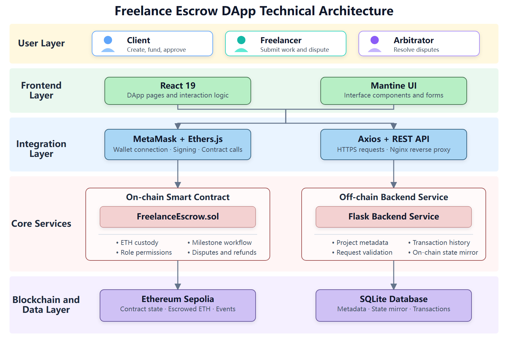
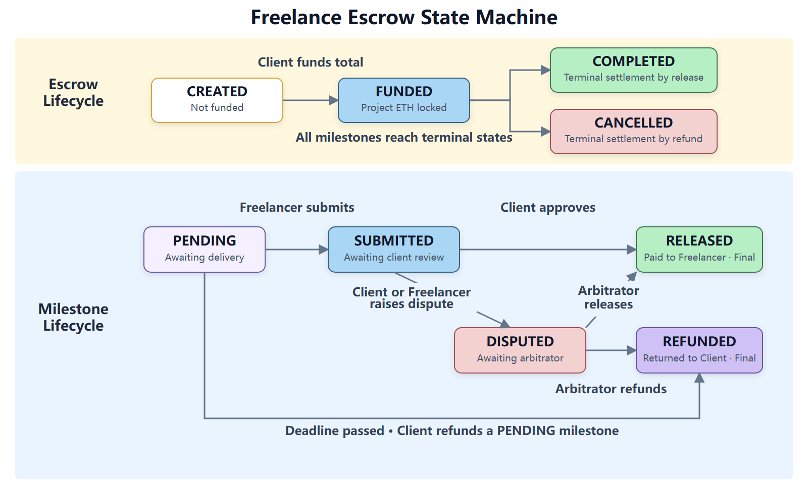

# SC6113 Individual Assignment Report

## Blockchain-Based Milestone Escrow for Freelance Payments

## 1. Introduction

Smart contracts make payment rules public and enforceable without giving an application operator control over users' funds. In this DApp, users sign transactions with MetaMask, and an Ethereum contract applies the agreed escrow rules.

The project applies this model to freelance work. A client funds the project upfront, reviews delivery by milestone, and releases payment in stages. The scope covers custody, conditional release, disputes, refunds, and transaction history.

## 2. Problem Statement

Advance payment exposes a client to non-delivery; payment after completion exposes a freelancer to non-payment. A centralised escrow service reduces these risks but requires both parties to trust its custody and decisions. This project asks: **How can milestone payments and disputes be handled transparently without giving one platform sole control of the funds?**

The client deposits the full amount in Sepolia test ETH, and milestones settle separately. Each project has a client-appointed arbitrator. The database supports queries; the contract remains authoritative for funds and permissions.

## 3. Objectives

1. Hold project funds in a smart contract and settle each milestone according to approval, arbitration, or refund rules.
2. Enforce Client, Freelancer, and Arbitrator permissions and prevent duplicate payments.
3. Support creation, funding, milestone actions, disputes, and transaction queries through MetaMask.
4. Keep funds and business states on-chain while Flask and SQLite provide searchable metadata and history.
5. Make the DApp usable on desktop and in MetaMask's mobile browser with clear validation and transaction feedback.
6. Test normal and invalid workflows and assess security, usability, performance, and consistency limits.

## 4. System Architecture

### 4.1 Functional Architecture

The modules below cover the escrow lifecycle and its three participant roles.

| Module | Main Functions | Roles |
|---|---|---|
| Wallet and Identity | Connect MetaMask; track account, network, and balance | All roles |
| Escrow Management | Set participants, deadline, and milestones; create and fund escrow | Client |
| Milestone Processing | Submit work; approve and release funds; request timeout refund | Client, Freelancer |
| Dispute Resolution | Raise disputes; arbitrate release or refund | Client, Freelancer, Arbitrator |
| Project Queries | View dashboard, escrow details, states, and available actions | All roles |
| Transactions and Synchronisation | Store metadata and confirmed transactions; filter history and open Etherscan | All roles, backend |

Available actions depend on the wallet address, project role, and contract state. The contract performs the final permission check.

### 4.2 Technical Architecture

The frontend uses MetaMask and Ethers.js for signed contract calls, and Axios and REST endpoints for metadata and history.

*Figure 1: Freelance Escrow DApp Technical Architecture*

The contract controls funds, permissions, and states. Flask stores validated application data in SQLite; it holds no private keys and does not sign transactions.

### 4.3 Transaction Data Flow

For milestone approval, the client confirms the action, signs `approveMilestone()` in MetaMask, and waits for Sepolia confirmation. The frontend then sends the transaction hash, block number, escrow ID, and action to Flask. Flask records the transaction and mirrors the `RELEASED` state. A database write failure triggers a warning but does not undo the on-chain transfer.

## 5. Technologies Used

| Layer | Technology | Purpose |
|---|---|---|
| Blockchain | Ethereum Sepolia | Test transactions and contract events |
| Smart Contract | Solidity `^0.8.20` | Escrow rules, permissions, transfers, and refunds |
| Contract Tooling | Remix IDE | Compile, deploy, and generate ABI; build metadata records compiler 0.8.34 |
| Wallet and Web3 | MetaMask, Ethers.js 6 | Signing, contract calls, and receipts |
| Frontend | React 19, Vite 8, Mantine 9 | Pages, forms, responsive UI, and notifications |
| Backend | Python, Flask, Flask-SQLAlchemy | REST API, validation, and persistence |
| Database | SQLite | Metadata, state mirror, and transaction history |
| Deployment | Cloud server, Nginx, Gunicorn | Serve frontend and backend separately |
| Version Control | Git, GitHub | Source control |

## 6. Smart Contract Design

### 6.1 Data Model and State Machine

`FreelanceEscrow.sol` stores participant addresses, amounts, deadline, and project state in each escrow. Each milestone has a description, amount, state, and timestamps. Figure 2 shows the normal approval route, dispute branches, and the separate timeout refund path.

*Figure 2: Escrow and Milestone State Machine*

`RELEASED` and `REFUNDED` are terminal states. Once all milestones settle, the escrow becomes `COMPLETED` or `CANCELLED`.

### 6.2 Core Functions

| Function | Caller | Main Rules and Result |
|---|---|---|
| `createEscrow` | Client | Distinct nonzero addresses, future deadline, and at least one positive-value milestone |
| `fundEscrow` | Client | `CREATED` escrow; deposit must equal the total |
| `submitMilestone` | Freelancer | Funded escrow; `PENDING` milestone |
| `approveMilestone` | Client | `SUBMITTED` milestone; release funds to Freelancer |
| `raiseDispute` | Client or Freelancer | Dispute a `SUBMITTED` milestone |
| `resolveDispute` | Appointed Arbitrator | Release to Freelancer or refund Client |
| `refund` | Client | Refund a `PENDING` milestone after the deadline |

Each action emits an event, such as `EscrowCreated`, `MilestoneApproved`, or `DisputeResolved`, for blockchain auditing and future indexing.

### 6.3 Security Design

- **Access and validation:** Role checks and state guards reject unauthorised actions. Creation rejects invalid addresses, dates, empty descriptions, and zero amounts; terminal milestone states prevent repeat payments.
- **Transfers:** Checks-Effects-Interactions updates state before the external ETH `call`; a failed transfer reverts the transaction. `receive()` rejects direct deposits.
- **Keys and amounts:** MetaMask keeps signing on the user's device. Solidity 0.8 checks overflow; the application uses integer wei and numeric strings instead of floating-point amounts.

Creating an escrow stores every milestone description on-chain, so longer or more numerous milestones raise gas costs.

## 7. Application Design

### 7.1 Frontend Pages and Interaction

The frontend has four pages: **Dashboard** presents role-specific projects and statistics; **Create Escrow** collects participants, deadline, and milestones in three steps; **Escrow Detail** shows funding and milestone states with role-specific actions; and **Transaction History** filters records and links to Sepolia Etherscan. Forms validate addresses, distinct roles, future dates, descriptions, and positive ETH amounts with up to six decimal places. Irreversible actions require confirmation.

The MetaMask mobile browser is the primary interface. It uses bottom navigation, a compact header, touch targets of at least 44 px, stacked actions, and transaction cards. Desktop users see side navigation and tables. Long titles and addresses wrap or shorten, with copy and explorer links where relevant.

### 7.2 Backend API and Database

Flask uses an application factory and registers its blueprints under `/api`. The main endpoints are:

| Method | Endpoint | Function |
|---|---|---|
| GET | `/api/escrows` | Query and paginate escrows by address, role, and state |
| GET | `/api/escrows/<id>` | Return one escrow and its milestones |
| POST | `/api/escrows` | Store project metadata after on-chain creation is confirmed |
| GET | `/api/transactions` | Query transaction history by escrow, address, action, and status |
| POST | `/api/transactions` | Store a confirmed transaction and update the off-chain state mirror |

SQLite stores `escrows`, `milestones`, and `transactions`. Addresses are normalised to lowercase; amounts are stored as wei strings. Unique milestone keys and transaction hashes prevent duplicates. The API validates request fields and returns stable error codes.

## 8. Implementation

### 8.1 Wallet and Blockchain Calls

The EIP-1193 provider connects through `eth_requestAccounts`, restores authorisation through `eth_accounts`, and responds to `accountsChanged` and `chainChanged`. `WalletContext` shares account and network state. Write operations request a MetaMask signature, await the receipt, and show status through Mantine Notifications. After creation, the frontend reads `escrowId` from `EscrowCreated`; confirmed actions are then reported to the backend.

### 8.2 Data Consistency and Error Handling

The interface distinguishes blockchain confirmation from database synchronisation. If an escrow is created on-chain but saving its metadata fails, the user sees a synchronisation warning rather than a failed-transaction message. Unique transaction hashes prevent duplicate records; only `CONFIRMED` records update mirrored states. API errors, rejected signatures, and contract reverts produce separate feedback.

### 8.3 Deployment

The frontend and backend run as separate services on a self-hosted cloud server. `npm ci && npm run build` produces frontend static files for Nginx, which also handles SPA fallback and proxies `/api` to the Flask service started by Gunicorn with `run:app`. The browser uses one origin without connecting to the internal backend port. The frontend build receives the Sepolia contract address through an environment variable and includes the contract ABI. The primary site is <https://escrow.wuziran.fun/>.

The project also has a backup deployment on Render. Its frontend is available at <https://freelance-escrow-front.onrender.com>, and its backend is available at <https://freelance-escrow-api.onrender.com>. The Render backend may sleep after a period without requests. If the backup frontend cannot retrieve data on the first visit, opening <https://freelance-escrow-api.onrender.com/api/escrows?page_size=1> starts the backend service; the frontend can then be refreshed. The self-hosted URL above is recommended for assessment.

## 9. Testing and Results

### 9.1 Test Environment and Functional Verification

Manual tests used separate Client, Freelancer, and Arbitrator MetaMask accounts on Sepolia. The cases cover successful flows, invalid input, and unauthorised actions.

### 9.2 Test Cases and Results

| Module | Test Case ID | Procedure | Expected Result | Actual Result |
|---|---|---|---|---|
| Wallet Connection | T01 | Connect, refresh, then switch MetaMask account and network | Authorisation restores; address, balance, network, and project data update | Pass |
| Escrow Creation | T02 | Create with valid participants, future deadline, and milestones | Contract returns escrow ID; backend stores metadata | Pass |
| Escrow Creation | T03 | Submit invalid address, repeated role, past date, empty description, or zero amount | Form or contract rejects creation with an error | Pass |
| Escrow Funding | T04 | Fund the exact total as Client | Funds lock; state becomes `FUNDED` | Pass |
| Escrow Funding | T05 | Use wrong amount or role, or fund twice | Transaction reverts; funds and state stay unchanged | Pass |
| Milestone Processing | T06 | Submit as Freelancer, then approve as Client | `PENDING` → `SUBMITTED` → `RELEASED`; Freelancer receives milestone funds | Pass |
| Milestone Processing | T07 | Repeat release or use wrong role or state | Transaction reverts; no duplicate payment | Pass |
| Dispute Resolution | T08 | Dispute submitted work; arbitrator chooses release or refund | State becomes `DISPUTED`, then `RELEASED` or `REFUNDED`; correct party paid | Pass |
| Dispute Resolution | T09 | Resolve as an unappointed account | Transaction reverts; dispute remains unchanged | Pass |
| Timeout Refund | T10 | Refund before and after deadline, including non-Client account | Only Client succeeds after deadline on a `PENDING` milestone | Pass |
| Project Display | T11 | View dashboard and detail as each role | Relevant projects, statistics, states, and actions appear | Pass |
| Transaction History | T12 | Filter confirmed transactions | History, pagination, and Etherscan links work | Pass |
| User Interface | T13 | Use desktop and MetaMask mobile browsers | Layout fits; key controls remain usable | Pass |
| Error Handling | T14 | Reject signing or simulate API failure | Specific error and retry or cancel path appears | Pass |

### 9.3 Mobile Test Screenshots

Capture these composite figures in the MetaMask mobile browser, showing Sepolia and relevant outcomes. Exclude seed phrases, private keys, and unrelated personal information.

> **Mobile screenshot placeholder - Figure 3: Wallet Connection and Dashboard (T01, T11, T13)**  
> Include wallet state, role selection, statistics, and navigation.  
> Suggested file: `images/mobile-test-01-wallet-dashboard.png`

> **Mobile screenshot placeholder - Figure 4: Escrow Creation and Funding (T02-T05)**  
> Include the form and `CREATED` and `FUNDED` states.  
> Suggested file: `images/mobile-test-02-create-fund.png`

> **Mobile screenshot placeholder - Figure 5: Milestones and Dispute Resolution (T06-T10)**  
> Include submission, dispute, arbitration, and final settlement.  
> Suggested file: `images/mobile-test-03-milestone-dispute.png`

> **Mobile screenshot placeholder - Figure 6: Escrow Detail, Transaction History, and Errors (T11, T12, T14)**  
> Include funding, role actions, history, Etherscan, and an error message.  
> Suggested file: `images/mobile-test-04-detail-history-error.png`

### 9.4 Results Evaluation

The tested workflows passed, and invalid actions were rejected. Confirmed state changes appeared in the interface and history. Tests were manual; automated contract and API tests remain outstanding.

## 10. Challenges Encountered

1. **State synchronisation:** A confirmed on-chain transaction can be followed by a failed backend write. The UI treats the chain result as authoritative and warns about the missing mirror.
2. **Roles and states:** A wallet may hold different roles across escrows. Detail-page checks derive available actions from both role and state.
3. **ETH precision:** `parseEther`, `BigInt`, and wei strings avoid JavaScript floating-point errors.
4. **Mobile layout:** Bottom navigation, cards, stacked buttons, and safe-area spacing support MetaMask's limited viewport.

## 11. Limitations

- The backend does not independently verify reported transactions through RPC or index contract events. Its mirror can be incomplete or polluted by falsified requests, though on-chain funds are unaffected.
- One appointed arbitrator can delay a dispute indefinitely by remaining inactive.
- On-chain descriptions raise gas costs and cannot be deleted.
- History is saved after confirmation; the `PENDING` filter has no persisted pending records.
- Public, linkable addresses provide pseudonymity, not anonymity.

## 12. Future Improvements

1. Index contract events with saved block checkpoints and verify reported receipts through RPC.
2. Assess pull payments, `ReentrancyGuard`, pause controls, and emergency recovery.
3. Add multisignature or decentralised arbitration with timeout and replacement rules.
4. Move long descriptions off-chain and retain their hashes on-chain.
5. Persist pending and failed transactions and reconcile database records with chain events.

## 13. Conclusion

The DApp demonstrates milestone-based freelance escrow on Sepolia. Its contract enforces custody, roles, settlement, disputes, and timeout refunds, while MetaMask signs transactions and Flask provides searchable metadata and history. Manual tests covered the main and invalid workflows. Independent verification of off-chain records, automated tests, arbitration resilience, and gas efficiency remain the principal improvements.
